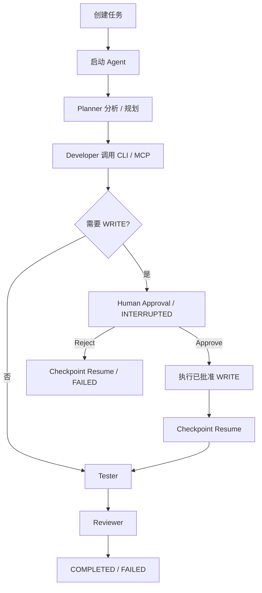
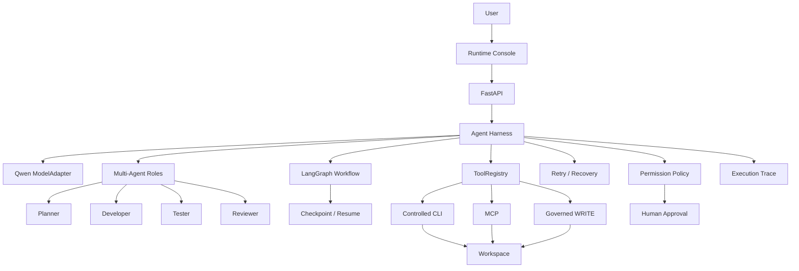
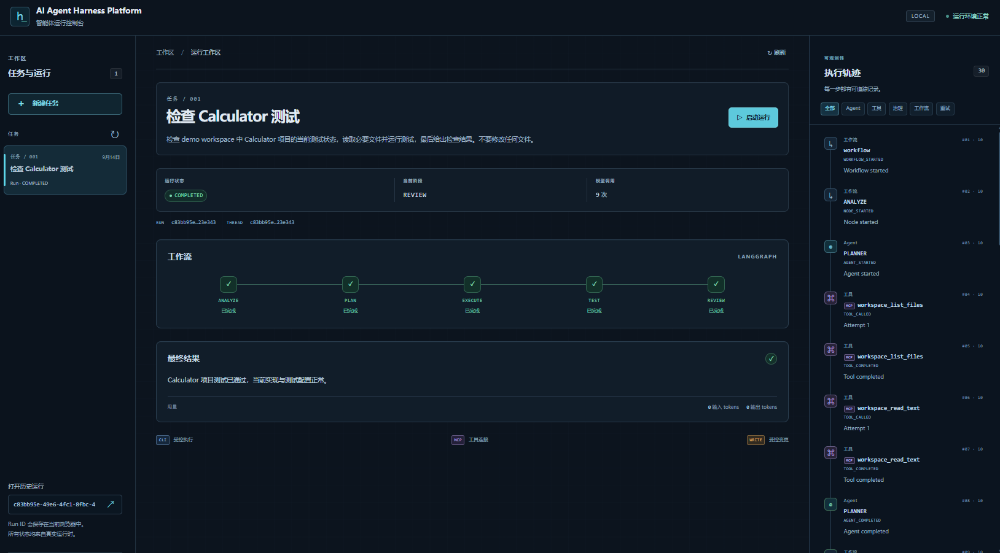
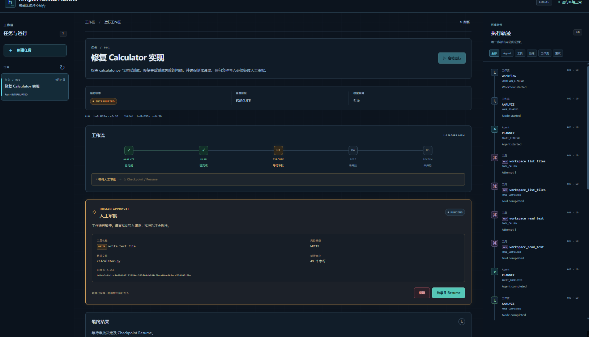
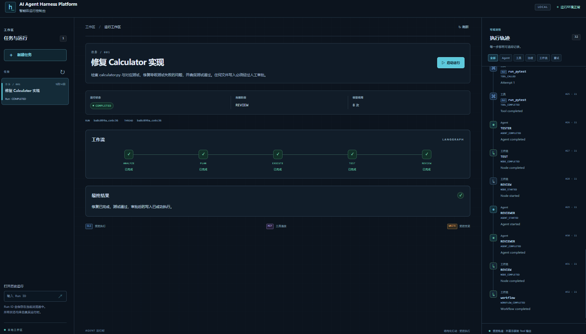

# AI Agent Harness Platform

面向软件工程任务的 Agent Runtime / Harness，统一模型、CLI/MCP Tools、LangGraph Workflow、Checkpoint/Resume、Multi-Agent、Retry、Permission Governance 与 Human Approval。

## 项目简介

项目关注智能体的执行过程：模型如何产生结构化行动、工具如何受控执行、工作流如何暂停和恢复，以及每次行动如何被追踪。软件工程任务是验证 Harness Runtime 的 Demo 场景，项目不以实现 Codex Clone 为目标。

## 核心能力

- 真实 Qwen：通过 DashScope OpenAI-compatible SDK 调用，解析和校验已有 HarnessAction。
- 工具统一：Controlled CLI、标准 MCP 与受审批约束的文件写入共用 ToolAdapter / ToolRegistry。
- 固定角色协作：Planner、Developer、Tester、Reviewer 由 LangGraph 调度。
- 持久化与治理：SQLite Checkpoint、有限工具重试、风险权限、加密 PendingApproval。
- 可观测性：有限 Execution Trace、运行结果、模型调用次数与 token 用量。
- Runtime Console：Vue 3 三栏控制台，中文操作文案、英文技术状态，支持审批和原 Run Resume。

## 使用流程

创建任务后点击“启动运行”。读取和测试在授权范围内执行；遇到 WRITE 时，检查审批卡片中的工具、路径、风险和内容摘要，再选择批准或拒绝。批准会执行保存的写入请求，前端随后恢复原运行；拒绝也恢复原 checkpoint，将 denied result 转为明确失败。完成后查看结果、Workflow 和 Trace。



Task 创建只保存任务记录；执行状态属于 Run，不把任务表的 PENDING 误认为当前 Run 状态。已有运行可在“打开历史运行”中输入 Run ID。浏览器只记住已知 Run ID，实际状态始终从后端读取。

## 系统架构



## 项目截图

最终 UI 截图使用 deterministic Demo State 稳定复现 Runtime Console 的运行状态；真实 Qwen 端到端验证结果见后文「真实 E2E」。

这些 Demo 状态仍真实经过 Workflow、ToolRegistry、PermissionPolicy、PendingApproval 与 Checkpoint / Resume；截图本身不代表实时 Qwen Run。

### Runtime Overview



> 展示完整的 Multi-Agent Workflow、MCP/CLI 工具调用与 Execution Trace。

### Human Approval



> 高风险 WRITE 被 PermissionPolicy 拦截，Workflow 进入 INTERRUPTED，并生成 PENDING Approval 等待人工决策。

### Checkpoint Resume



> 批准 WRITE 后从原 checkpoint 恢复，继续执行 TEST / REVIEW 并最终完成任务。

## 技术栈

| 层 | 实现 |
| --- | --- |
| API / 数据 | Python 3.12、FastAPI、Pydantic v2、pydantic-settings、SQLAlchemy 2、SQLite |
| 模型 / 工作流 | OpenAI SDK（DashScope compatible）、LangGraph、SQLite Checkpointer |
| 工具 / 审批 | MCP Python SDK、受控 subprocess、WorkspacePolicy、Fernet |
| 控制台 | Vue 3、TypeScript、Vite、Axios、原生 CSS |
| 验证 | pytest / httpx；Playwright 前端 mock API 测试；独立真实 Demo |

Python 依赖只维护在 `pyproject.toml`；前端依赖及锁文件位于 `frontend/`。

```text
app/
  adapters/          # QwenModelAdapter
  agents/            # 四角色与节点 Handler
  api/routes/        # Task / Run / Approval
  core/              # 配置、异常
  db/ models/        # tasks、runs、approvals
  harness/           # Action、协议、Registry、Runner、Trace
  governance/        # 权限、Retry、Approval
  tools/             # CLI、MCP、Workspace、WRITE
  workflow/          # LangGraph、checkpoint
  schemas/ services/
frontend/
  src/api/ src/components/
  src/App.vue src/useConsole.ts src/style.css
  tests/
demo_workspace/      # 极小 calculator fixture
scripts/             # 本地启动与真实 Demo
tests/               # 后端测试
docs/                # Stage 文档及项目截图
```

## Agent Workflow

`ANALYZE → PLAN → EXECUTE → TEST → REVIEW`。测试失败或 Reviewer 返回 NEEDS_FIX 时进入 `FIX → TEST → REVIEW`，受 `WORKFLOW_MAX_ITERATIONS` 限制；不可恢复错误终止。WRITE 进入独立的 Approval 等待节点，使用官方 interrupt / Command(resume=...)。

## Harness Core

HarnessContext 保存 task_id、run_id、instruction、iteration、max_iterations 和 metadata。模型通过 ModelAdapter 返回 FINAL 或 TOOL_CALL，Runner 不猜测自由文本。ToolRegistry 注册、发现和查找工具，拒绝重复名称及未知工具。Trace 记录 sequence、iteration、event_type、name、success、summary。

简单 HarnessRunner 保留有界行动循环；完整角色执行由现有 WorkflowRunner 协调，二者复用工具与行动协议。

## CLI vs MCP

| 类型 | 用途 | 当前工具 |
| --- | --- | --- |
| CLI | 封装成熟本地开发工具 git / pytest / rg，固定命令与参数 schema，不暴露任意 shell | git_status、git_diff、run_pytest、search_text |
| MCP | 标准化、结构化、可发现的工具协议；当前连接本地只读 stdio server | mcp.workspace_list_files、mcp.workspace_read_text |
| WRITE | 仅执行已批准的完整文本写入 | write_text_file |

它们统一注册到 ToolRegistry 并实现 ToolAdapter；执行方无需根据底层来自 CLI 还是 MCP 写分支。WorkspacePolicy 限制路径、敏感文件和输出；pytest 仍会执行受信任 workspace 中的 Python 代码，因此这不是 OS sandbox。

## Checkpoint / Resume

LangGraph 在 SQLite 中持久化 Workflow State。审批时保存 pending_approval_id，Workflow 进入 INTERRUPTED。审批结果持久化后，以相同 thread_id 恢复原 checkpoint，不重新传入 START 任务。真实验证确认批准后的恢复只执行剩余 TEST / REVIEW，不重跑 ANALYZE / PLAN / 原 Developer 调用，也不重复执行 WRITE。

恢复必须保持 workspace、业务数据库、checkpoint 数据库和审批密钥一致。同一 thread 应串行恢复。

## Multi-Agent Roles

| 角色 | 阶段 | 工具调用预算（每节点） |
| --- | --- | --- |
| Planner | ANALYZE / PLAN | ANALYZE 最多 2 次只读；PLAN 为 0 |
| Developer | EXECUTE / FIX | 最多 4 次；WRITE 立即暂停审批 |
| Tester | TEST | 最多 2 次；pytest 返回后进入总结 |
| Reviewer | REVIEW | 0，依据已有执行和测试摘要判断 |

Multi-Agent 不是自由聊天：Workflow 决定角色顺序，Agent 不任意跳转。达到工具预算后只允许结构化总结回合；无效的额外请求失败。PLAN 只接收非空 `steps`，空数组最多一次简短格式修复。角色内历史和跨节点证据均限制长度，不发送完整 Trace。

## Retry / Recovery

工具只对明确瞬时错误（如 cli_timeout、mcp_call_tool_failed、process_start_failed、tool_timeout）进行有限重试，默认最多 2 次，包含首次尝试。权限拒绝、参数错误、未知工具等不重试。WRITE 批准后不自动重试。Qwen SDK 的通用重试关闭；API 错误、安全错误码、调用上限和无效输出明确终止。

## Permission Governance

| 风险等级 | 规则 |
| --- | --- |
| READ_ONLY | 四角色在各自节点预算内读取 |
| SAFE_EXECUTION | Developer / Tester 可请求受控测试 |
| WRITE | 仅 Developer 可请求，必须审批 |
| PRIVILEGED | 当前默认拒绝，不提供此类工具 |

工具参数先经过 schema 校验，再经过 PermissionPolicy。模型没有直接写文件的执行路径；Registry 对受治理工具返回 guard。角色看到工具定义不等于绕过运行时权限。

## Human Approval

`PermissionPolicy → PendingApproval → Human Approval`。审批 API 只接受决定，不允许替换已保存的工具参数。API 展示路径、字符数和 SHA-256，实际写入载荷使用配置提供的 Fernet key 加密保存，完成后清除载荷。

批准前文件不变；批准时原子占用 PENDING 并重新校验 workspace / 目标，随后执行 WRITE。拒绝产生 permission_denied，不执行文件写入。普通重复决策返回 409；不保证进程崩溃窗口中的 exactly-once 外部副作用。

## Runtime Console

三栏展示任务、Run Workspace 和 Execution Trace。深色界面保留技术名称，普通操作为中文；Stepper 展示阶段、FIX、审批与 Checkpoint Resume。所有内容来自真实 API，无硬编码示例 Trace。

当前 POST Run / Resume 为等待式请求，结束或审批中断才返回结果，前端不伪造实时进度。若取得 RUNNING 记录可有限轮询；没有 Run 列表 API，无法在请求中断且尚未获知 ID 时自动找回运行。此版本无 SSE / WebSocket。

## 快速开始

环境：Python 3.12、Node.js 22.12+（本项目在 Node 24 验证）、Git 和 rg。以下为 PowerShell：

```powershell
py -3.12 -m venv .venv
.\.venv\Scripts\Activate.ps1
python -m pip install -e ".[dev]"
if (-not (Test-Path .env)) { Copy-Item .env.example .env }
```

在本地 `.env` 中配置真实值，不覆盖已有配置，不提交密钥：

```dotenv
DASHSCOPE_API_KEY=your_dashscope_api_key
LLM_MODEL=qwen-plus
APPROVAL_ENCRYPTION_KEY=your_fernet_key
WORKSPACE_ROOT=./demo_workspace
```

审批密钥必须是有效 Fernet key，使用 cryptography 的 `Fernet.generate_key()` 在本地安全生成并保存。占位符不能用于真实写入审批；恢复未完成审批须保留原密钥。

```powershell
python -m uvicorn app.main:app --reload
```

另开终端：

```powershell
cd frontend
npm install
npm run dev
```

Swagger：<http://127.0.0.1:8000/docs>。Runtime Console 默认：<http://127.0.0.1:5173>（以 Vite 输出为准）。开发代理将 `/api` 转发至 8000，生产静态部署需配置同源 API 反向代理。

## 环境变量

| 变量 | 默认值 / 用途 |
| --- | --- |
| APP_NAME / APP_ENV | 项目名 / local |
| DATABASE_URL | sqlite:///./tasks.db；Task、Run、Approval |
| DASHSCOPE_API_KEY | SecretStr，无默认真实值 |
| LLM_MODEL | qwen-plus |
| DASHSCOPE_BASE_URL | DashScope 北京区 compatible-mode/v1；应与 key 地域匹配 |
| LLM_TIMEOUT_SECONDS / LLM_MAX_TOKENS / LLM_MAX_CALLS | 45 秒 / 1200 输出 tokens / 每 Run 16 次，正常 Resume 累加 |
| WORKSPACE_ROOT | 默认为当前目录；演示使用隔离目录 |
| CLI_TIMEOUT_SECONDS / CLI_MAX_OUTPUT_CHARS | 20 秒 / 20000 字符 |
| MCP_MAX_READ_CHARS / MCP_MAX_LIST_FILES | 20000 字符 / 200 条 |
| CHECKPOINT_DATABASE_URL | sqlite:///./workflow-checkpoints.db |
| WORKFLOW_MAX_ITERATIONS / RETRY_MAX_ATTEMPTS | 3 / 2 |
| WRITE_MAX_CHARS | 20000 |
| APPROVAL_ENCRYPTION_KEY | SecretStr，无默认密钥；Fernet 格式 |

模型消息有额外截断：instruction 3000 字符，PLAN 文件列表 500、分析证据 1000 字符；节点内保留最多 4 条工具历史，超出总上下文限额明确失败。调用次数和 token 是实际 SDK 用量记录，不代表美元费用估算。

## 核心 API

| 接口 | 作用 |
| --- | --- |
| GET /health | 健康检查 |
| GET /api/info | 非敏感项目信息 |
| POST /api/tasks | 创建任务 |
| GET /api/tasks | 列出任务 |
| GET /api/tasks/{id} | 读取任务 |
| POST /api/tasks/{task_id}/run | 真实角色 Workflow，返回 run/thread、status、output、有限 trace、usage、pending_approval_id |
| GET /api/runs/{run_id} | 读取持久化运行结果 |
| POST /api/runs/{run_id}/resume | 恢复原 checkpoint |
| GET /api/approvals/{id} | 脱敏审批信息 |
| POST /api/approvals/{id}/approve | 批准并执行保存的 WRITE |
| POST /api/approvals/{id}/reject | 拒绝，不执行 WRITE |

## 真实 E2E

以下结果来自独立的真实 Qwen 端到端验证，与上面的 deterministic UI Demo 截图分开记录。

| 场景 | 真实结果 |
| --- | --- |
| Read / Analyze | Real Qwen；MCP + CLI；完整四角色 Workflow，COMPLETED；12 次模型调用 |
| Fix + Approve | Real Qwen；WRITE 请求被治理层暂停；批准前 hash 不变，批准后才写入；原 checkpoint 恢复，pytest 1 passed、Reviewer PASS、COMPLETED；9 次模型调用 |
| Reject | Real Qwen；WRITE 请求 1 次、执行 0 次；拒绝后文件 SHA-256 不变，permission_denied、无 retry，最终 FAILED(approval_failed)，符合预期；6 次模型调用 |

真实 Demo 位于极小 calculator workspace；运行副本、数据库、日志和本地报告不提交。真实调用脚本与自动测试分离，成功场景不为确认而重复执行。

开发验证按阶段选取测试：前端 `npm test` 使用 mock API（需本机 Chrome），`npm run build` 执行类型检查与生产构建。后端单测不依赖真实 DashScope。阶段验证记录与最终 UI 联调证据见 [Stage 6](docs/stage6.md)。

## 项目边界

软件工程任务只是 Harness Demo。本项目不提供 unrestricted shell、Docker / VM sandbox，不保证 exactly-once external side effects，不自动 git push；不做大型分布式调度、完整 IDE、RAG、企业认证 / RBAC 或 Multi-Tenant。当前 API 面向可信本地环境。这些是明确的项目 scope。

## Stage 文档

[Stage 1 · Foundation](docs/stage1.md) · [Stage 2 · Harness Core](docs/stage2.md) · [Stage 3 · CLI / MCP](docs/stage3.md) · [Stage 4 · Workflow / Checkpoint](docs/stage4.md) · [Stage 5 · Governance / Approval](docs/stage5.md) · [Stage 6 · Qwen / Console / Finalization](docs/stage6.md)
